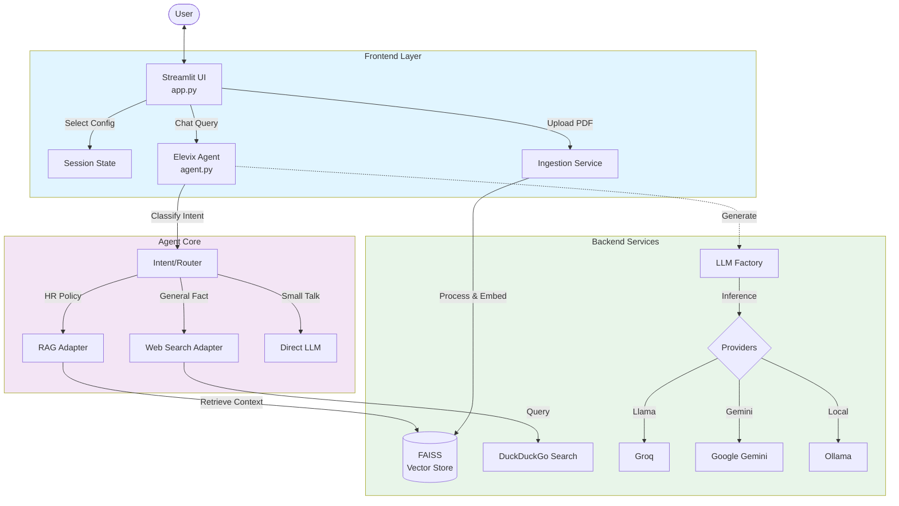

Elevix Chat Agent - Technical Architecture
1. System Overview
The Elevix Chat Agent is a modular, AI-powered conversational assistant designed for HR support and general knowledge retrieval. It integrates Retrieval-Augmented Generation (RAG) for company-specific documents and Web Search for real-time information, orchestrating these tools via a central agentic core. The user accesses these capabilities through a responsive Streamlit interface.

2. Architecture Diagram

3. Component Details
3.1 Frontend (Streamlit)
File: 
elevix_chat_agent/app.py
Responsibilities:
User Interface: Renders chat history, message input, and citations.
Session Management: Maintains chat history (st.session_state.messages) and agent state.
Configuration: Sidebar for selecting LLM Providers (Groq, Gemini, Ollama) and specific models.
Document Upload: Handles PDF file uploads and triggers the ingestion pipeline dynamically.
3.2 Agent Core
File: 
elevix_chat_agent/src/agent.py
Responsibilities:
Orchestration: Central 
ElevixAgent
 class manages the conversation flow.
Intent Classification: Determines if a query is for "HR Policy", "General Knowledge", or "Small Talk".
Memory: Simple in-memory history management for conversation context.
3.3 Adapters & Tools
RAG Adapter (
src/adapters.py
): Wraps the elevix_rag chain. Returns structured responses with answer text and source citations (filename, page).
Web Search Adapter (
src/adapters.py
): Uses DuckDuckGoSearchResults to fetch real-time info. Parses results to provide structured citations (Title, URL, Snippet).
3.4 RAG Module (elevix_rag)
Ingestion (
ingest.py
): Loads PDFs, splits text into chunks, generates embeddings using sentence-transformers/all-MiniLM-L6-v2, and stores them in a local FAISS index.
Retrieval: Uses semantic similarity to find relevant document chunks.
3.5 LLM Factory
File: 
elevix_rag/llm_factory.py
Responsibilities:
Abstracts the creation of LLM clients.
Supports dynamic switching between providers (ChatGroq, ChatGoogleGenerativeAI, ChatOllama).
Accepts model_name for fine-grained control (e.g., swapping llama-3.3-70b-versatile vs llama3-8b-8192).
4. Data Flow
Initialization: User selects a provider/model. 
app.py
 calls llm_factory.get_llm() and initializes 
ElevixAgent
.
User Query: User types a valid question (e.g., "What is the leave policy?").
Classification: Agent determines key intent (HR Policy).
Retrieval:
Agent calls 
RAGToolAdapter
.
Adapter queries FAISS vector store.
Relevant text chunks are retrieved.
Generation:
RAG chain constructs a prompt with Context + Query.
LLM generates an answer based only on the context.
Response:
Agent receives validity check + Answer + Sources.
UI displays the text and renders "View Sources" expander.
5. Technology Stack
Language: Python 3.10+
Frontend: Streamlit
Orchestration: LangChain
Vector Store: FAISS
Embeddings: HuggingFace (all-MiniLM-L6-v2)
LLM Providers: Groq API, Google Gemini API, Ollama (Local)
Search: DuckDuckGo
Utilities: python-dotenv, python-docx